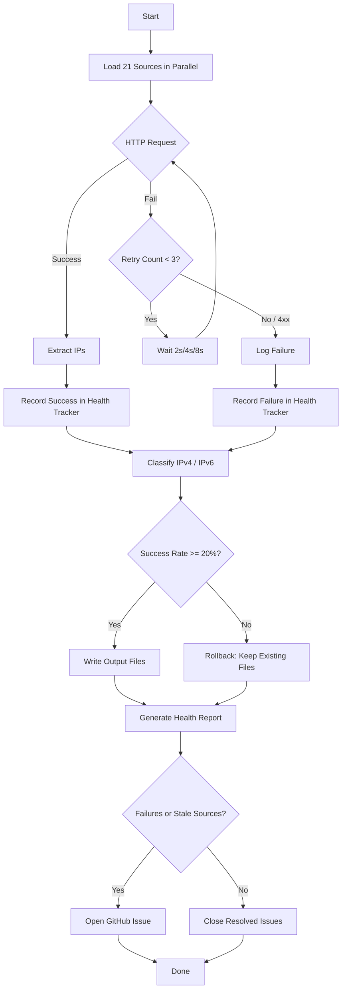
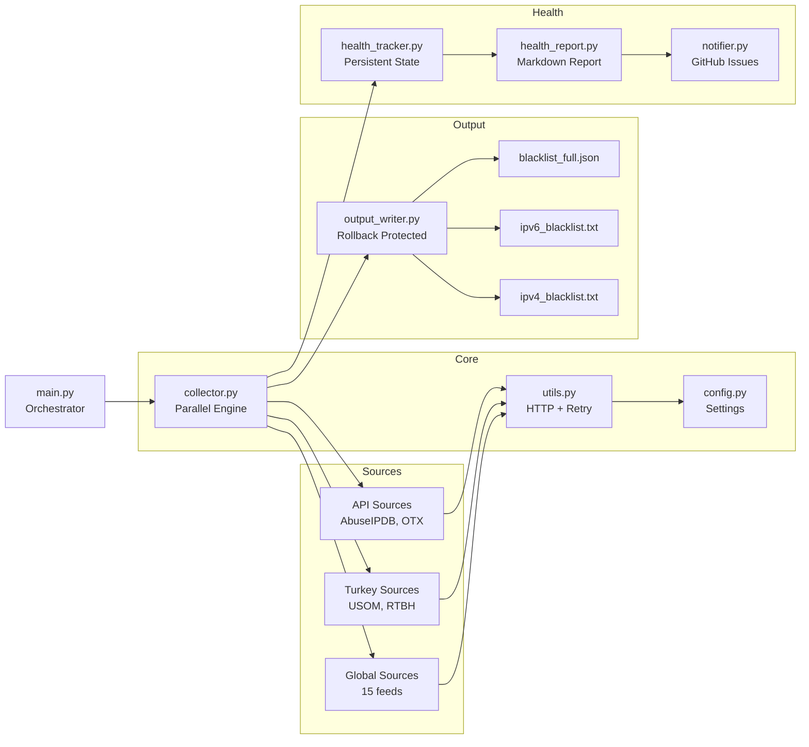

# Threat Intel IP Blacklist Aggregator


Enterprise-grade threat intelligence collector that aggregates malicious IP addresses from **21 free sources** worldwide, producing deduplicated IPv4 and IPv6 blacklists.

## Features

- **21 Sources** - Spamhaus, abuse.ch, DShield, Blocklist.de, CINS Army, Emerging Threats, USOM, AbuseIPDB, AlienVault OTX and more
- **IPv4/IPv6 Separation** - Separate output files for easy firewall/SIEM integration
- **Parallel Collection** - All sources fetched concurrently via ThreadPoolExecutor
- **~120,000+ unique IPs** per run from global threat intelligence feeds

## Failsafe Mechanisms

| Mechanism | How It Works |
|-----------|-------------|
| **Error Isolation** | Each source runs in its own try/except. One source crashing never affects the other 20 |
| **Auto Retry** | Failed HTTP requests retry 3 times with exponential backoff (2s, 4s, 8s). Permanent errors (4xx) skip retry |
| **Rollback Protection** | If all sources fail or success rate drops below 20%, existing output files are NOT overwritten |
| **Health Tracking** | `source_health.json` tracks each source's history: consecutive failures, last success, total runs |
| **Stale Detection** | Sources with no data for 30+ days are flagged in the health report |
| **GitHub Issue Alerts** | Automatic issue creation on failures with `source-health` label, auto-close on recovery |
| **Exit Codes** | `0` = all OK, `1` = partial failures (output written), `2` = critical failure (output preserved) |

## Firewall Ready List

Copy this URL directly into your firewall, SIEM, or threat intel platform:

```
https://raw.githubusercontent.com/ziyadnz/threat-intel-ip-feeds/main/output/hourlyIPv4.txt
```

This file contains **only IP addresses and CIDRs**, one per line - no comments, no headers, no metadata. Updated hourly. Designed for direct import into:
- pfSense, OPNsense, FortiGate, Palo Alto, Cisco ASA
- Suricata, Snort, Zeek
- Splunk, QRadar, Wazuh, ELK
- iptables, nftables, fail2ban
- Any system that accepts a plain text IP blocklist

## Quick Start

```bash
pip install -r requirements.txt
python main.py
```

### With API Keys (optional, for extra sources)

```bash
export ABUSEIPDB_API_KEY="your_key"
export OTX_API_KEY="your_key"
python main.py
```

## Output Files

| File | Description |
|------|-------------|
| `output/hourlyIPv4.txt` | Raw IPv4 list - firewall ready, no comments |
| `output/ipv4_blacklist.txt` | IPv4 addresses and CIDRs with metadata |
| `output/ipv6_blacklist.txt` | IPv6 addresses and CIDRs |
| `output/blacklist_full.json` | Full dataset with metadata |
| `output/source_health.json` | Source health tracking data |
| `output/health_report.md` | Human-readable health report |

## Sources

### Global (No Registration)
Spamhaus DROP/DROPv6, Feodo Tracker, DShield/SANS ISC, Blocklist.de (7 categories), CINS Army, Emerging Threats, BinaryDefense, GreenSnow, Tor Exit Nodes, Stamparm IPsum

### Turkey
USOM, RTBH

### API Key Required (Free Registration)
- **AbuseIPDB** - [Register](https://www.abuseipdb.com/register)
- **AlienVault OTX** - [Register](https://otx.alienvault.com)

## How It Works



## Architecture



## License

MIT
