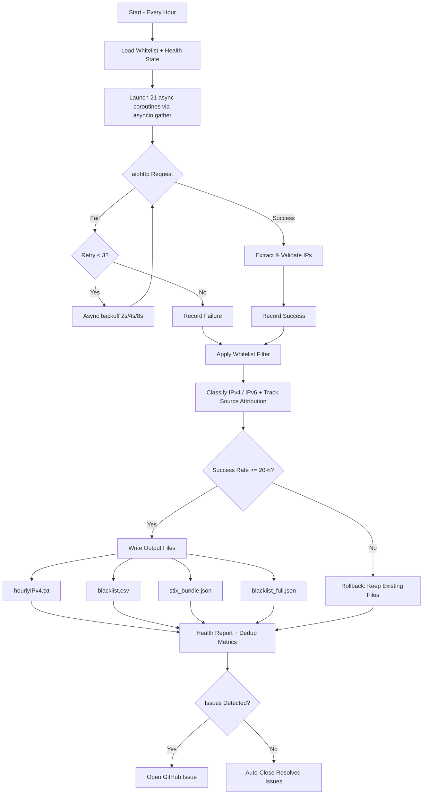
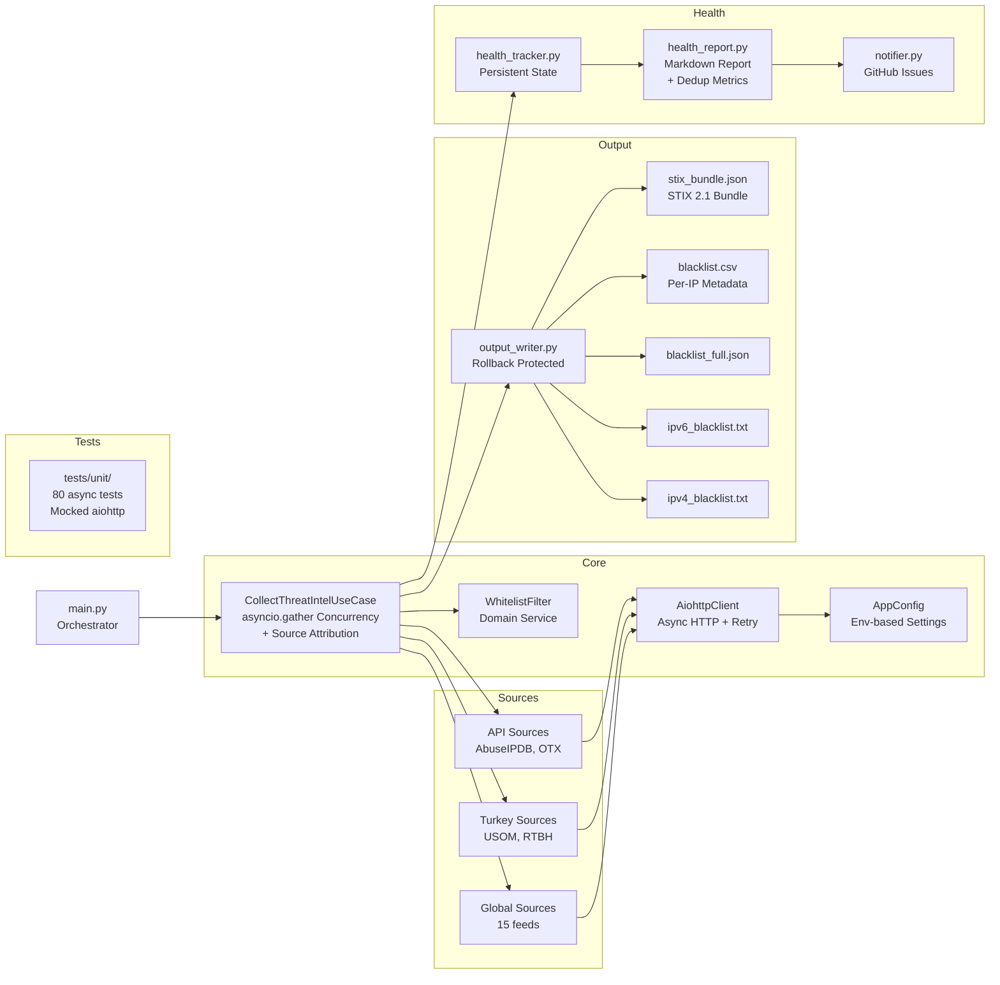

# Threat Intel IP Feeds


**Hourly updated, firewall-ready IP blocklist aggregated from 19+ threat intelligence sources. ~120,000+ unique malicious IPs, deduplicated, validated, and ready to import.**

```
https://raw.githubusercontent.com/ziyadnz/threat-intel-ip-feeds/main/output/hourlyIPv4.txt
```
Copy the URL above into your firewall, SIEM, or any tool that accepts a plain-text IP blocklist. One IP/CIDR per line, no comments, no headers. Updated every hour.

---

## Quick Usage Examples

### FortiGate

> Full documentation: [FortiGate External Block List Policy Guide](https://docs.fortinet.com/document/fortigate/7.0.0/administration-guide/891236/external-blocklist-policy)


<details>
<summary><b>Step-by-step GUI guide</b></summary>

#### Step 1 — Create External Threat Feed

Navigate to **Security Fabric > External Connectors > Create New > Threat Feeds > IP Address**

| Field | Value |
|-------|-------|
| **Name** | `ThreatIntel-IPFeed` |
| **URL** | `https://raw.githubusercontent.com/ziyadnz/threat-intel-ip-feeds/main/output/hourlyIPv4.txt` |
| **Refresh Rate** | `60` minutes |
| **Status** | Enabled |

After saving, the feed should show a green status with the number of entries loaded under **Security Fabric > External Connectors**.

#### Step 2 — Create Inbound Block Policy

Navigate to **Policy & Objects > Firewall Policy > Create New**

| Field | Value |
|-------|-------|
| **Name** | `Block-ThreatIntel` |
| **Incoming Interface** | `wan1` (or your WAN interface) |
| **Outgoing Interface** | `any` |
| **Source** | `ThreatIntel-IPFeed` |
| **Destination** | `all` |
| **Action** | **DENY** |
| **Log Violation Traffic** | Enabled |

> **Important:** Place this policy **above** your allow rules so it takes priority.

#### Step 3 (Optional) — Block Outbound to Threat IPs

Create a second policy to block **internal hosts communicating with known malicious IPs** (C2 callback detection):

| Field | Value |
|-------|-------|
| **Name** | `Block-Outbound-ThreatIntel` |
| **Incoming Interface** | `lan` / `internal` |
| **Outgoing Interface** | `wan1` |
| **Source** | `all` |
| **Destination** | `ThreatIntel-IPFeed` |
| **Action** | **DENY** |
| **Log Violation Traffic** | Enabled |

</details>

<details>
<summary><b>FortiGate CLI alternative</b></summary>

```
config system external-resource
    edit "ThreatIntel-IPFeed"
        set type address
        set resource "https://raw.githubusercontent.com/ziyadnz/threat-intel-ip-feeds/main/output/hourlyIPv4.txt"
        set refresh-rate 60
    next
end

config firewall policy
    edit 0
        set name "Block-ThreatIntel"
        set srcintf "wan1"
        set dstintf "any"
        set srcaddr "ThreatIntel-IPFeed"
        set dstaddr "all"
        set action deny
        set schedule "always"
        set logtraffic all
    next
end
```

</details>

---

### Palo Alto

> Full documentation: [PAN-OS External Dynamic Lists](https://docs.paloaltonetworks.com/pan-os/11-0/pan-os-admin/policy/use-an-external-dynamic-list-in-policy/external-dynamic-list)


<details>
<summary><b>Step-by-step GUI guide</b></summary>

#### Step 1 — Create External Dynamic List

Navigate to **Objects > External Dynamic Lists > Add**

| Field | Value |
|-------|-------|
| **Name** | `ThreatIntel-IPFeed` |
| **Type** | `IP List` |
| **Source** | `https://raw.githubusercontent.com/ziyadnz/threat-intel-ip-feeds/main/output/hourlyIPv4.txt` |
| **Repeat** | `Hourly` |

Click **OK** to save.

#### Step 2 — Create Inbound Block Policy

Navigate to **Policies > Security > Add**

| Field | Value |
|-------|-------|
| **Name** | `Block-ThreatIntel-Inbound` |
| **Source Zone** | `Untrust` |
| **Source Address** | `ThreatIntel-IPFeed` |
| **Destination Zone** | `any` |
| **Action** | **Drop** |
| **Log at Session End** | Enabled |
| **Log Forwarding** | Select your log profile |

> **Important:** Move this rule **above** your allow rules.

#### Step 3 — Block Outbound (C2 Detection)

Add a second rule:

| Field | Value |
|-------|-------|
| **Name** | `Block-ThreatIntel-Outbound` |
| **Source Zone** | `Trust` |
| **Source Address** | `any` |
| **Destination Zone** | `Untrust` |
| **Destination Address** | `ThreatIntel-IPFeed` |
| **Action** | **Drop** |
| **Log at Session End** | Enabled |

#### Step 4 — Commit

Click **Commit** to apply changes. Verify the EDL is loaded under **Objects > External Dynamic Lists** — click the entry to see the number of IPs loaded.

</details>

<details>
<summary><b>Palo Alto CLI alternative</b></summary>

```
set address ThreatIntel-IPFeed external-dynamic-list url "https://raw.githubusercontent.com/ziyadnz/threat-intel-ip-feeds/main/output/hourlyIPv4.txt"
set address ThreatIntel-IPFeed external-dynamic-list type ip
set address ThreatIntel-IPFeed external-dynamic-list repeat hourly
```

</details>

### iptables
```bash
curl -s https://raw.githubusercontent.com/ziyadnz/threat-intel-ip-feeds/main/output/hourlyIPv4.txt \
  | while read ip; do iptables -A INPUT -s "$ip" -j DROP; done
```

### nftables
```bash
curl -s https://raw.githubusercontent.com/ziyadnz/threat-intel-ip-feeds/main/output/hourlyIPv4.txt \
  | nft add element inet filter blocklist
```

### fail2ban
Use as a persistent banlist in `jail.local`:
```ini
[threat-intel]
banaction = iptables-allports
bantime = 3600
findtime = 3600
```

### Suricata / Snort
Generate rules from the feed:
```bash
curl -s https://raw.githubusercontent.com/ziyadnz/threat-intel-ip-feeds/main/output/hourlyIPv4.txt \
  | awk '{print "drop ip "$1" any -> any any (msg:\"ThreatIntel Block\"; sid:9000001; rev:1;)"}' \
  > /etc/suricata/rules/threat-intel.rules
```

### Splunk / QRadar / Wazuh / ELK
Import the raw URL as a **threat intelligence feed** (lookup table or CSV input).

### STIX/TAXII Integration
The aggregator produces a STIX 2.1 JSON bundle at `output/stix_bundle.json`. Import it into any STIX-compatible platform:
```python
import json
with open("output/stix_bundle.json") as f:
    bundle = json.load(f)
print(f"{len(bundle['objects']) - 1} indicators loaded")
# Each indicator includes: pattern, confidence score, source labels, category
```

### Python
```python
import requests
blocklist = requests.get(
    "https://raw.githubusercontent.com/ziyadnz/threat-intel-ip-feeds/main/output/hourlyIPv4.txt"
).text.strip().split("\n")
print(f"{len(blocklist)} IPs loaded")
```

### CSV Analysis
The CSV output at `output/blacklist.csv` includes per-IP metadata:
```python
import csv
with open("output/blacklist.csv") as f:
    reader = csv.DictReader(f)
    multi_source = [r for r in reader if int(r["source_count"]) > 2]
    print(f"{len(multi_source)} IPs flagged by 3+ sources")
```

---

## Sources (19 feeds)

| Source | Type | Region | Registration |
|--------|------|--------|-------------|
| Spamhaus DROP / DROPv6 | CIDR blocklist | Global | None |
| Feodo Tracker (abuse.ch) | Botnet C2 | Global | None |
| DShield / SANS ISC | Intel feed | Global | None |
| Blocklist.de (7 categories) | Attack IPs | Global | None |
| CINS Army | Threat list | Global | None |
| Emerging Threats | Compromised IPs | Global | None |
| BinaryDefense | Artillery ban | Global | None |
| GreenSnow | Threat list | Global | None |
| Tor Exit Nodes | Anonymizer | Global | None |
| Stamparm IPsum | Multi-source aggregation | Global | None |
| **USOM** | Gov. threat feed | Turkey | None |
| **RTBH** | National blocklist | Turkey | None |
| AbuseIPDB | Crowd-sourced reports | Global | Free API key |
| AlienVault OTX | Pulse indicators | Global | Free API key |

> **Turkey-specific sources (USOM, RTBH) are rarely found in global aggregators** - this project includes them natively.

---

## Output Files

| File | Format | Use Case |
|------|--------|----------|
| [`hourlyIPv4.txt`](output/hourlyIPv4.txt) | Raw IPs, one per line | Firewall / EDL import |
| [`ipv4_blacklist.txt`](output/ipv4_blacklist.txt) | IPs + metadata header | Analysis / audit |
| [`ipv6_blacklist.txt`](output/ipv6_blacklist.txt) | IPv6 addresses + CIDRs | IPv6-capable systems |
| [`blacklist_full.json`](output/blacklist_full.json) | Full JSON dataset | API / programmatic use |
| [`blacklist.csv`](output/blacklist.csv) | CSV with per-IP metadata | SIEM enrichment / analysis |
| [`stix_bundle.json`](output/stix_bundle.json) | STIX 2.1 JSON bundle | Threat intel platforms |
| [`health_report.md`](output/health_report.md) | Markdown report | Monitoring |

### CSV Format

```csv
ip,type,is_cidr,sources,source_count,category,first_seen,last_seen
1.2.3.4,ipv4,False,Blocklist.de (ssh)|Stamparm IPsum,2,brute-force,2026-04-14T12:00:00+00:00,2026-04-14T12:00:00+00:00
5.6.0.0/16,ipv4,True,Spamhaus DROP,1,infrastructure,2026-04-14T12:00:00+00:00,2026-04-14T12:00:00+00:00
```

| Column | Description |
|--------|------------|
| `ip` | IP address or CIDR range |
| `type` | `ipv4` or `ipv6` |
| `is_cidr` | `True` if CIDR range, `False` if individual IP |
| `sources` | Pipe-separated list of source names that reported this IP |
| `source_count` | Number of independent sources (higher = more confident) |
| `category` | Threat category derived from primary source |
| `first_seen` / `last_seen` | Timestamps of observation |

### STIX 2.1 Bundle

Each IP becomes a STIX `indicator` object with:
- **Pattern**: `[ipv4-addr:value = '1.2.3.4']` (STIX pattern syntax)
- **Confidence**: 0-100, scaled by number of reporting sources (20 per source, capped at 100)
- **Labels**: Threat category + source names
- **Identity**: Aggregator system as the producer

### Deduplication Report

The health report (`output/health_report.md`) now includes source overlap analysis:
- How many IPs are unique to a single source vs. found in multiple sources
- Per-source contribution: unique IPs vs. overlapping IPs
- Top source-pair overlaps (which sources share the most IPs)

---

## IP Whitelisting

Prevent false positives by adding trusted IPs to `whitelist.txt`:

```
# CDN ranges — never block
104.16.0.0/12       # Cloudflare
8.8.8.8             # Google DNS
1.1.1.0/24          # Cloudflare DNS

# Our infrastructure
203.0.113.10
```

**How it works:**
- One IP or CIDR per line, comments start with `#`
- Individual IPs are filtered by exact match or CIDR containment
- CIDRs are filtered only if fully covered by a whitelisted range
- Supports both IPv4 and IPv6
- Whitelist stats appear in the health report and console summary
- The whitelist is applied **before** IPs enter the output files

---

## Reliability & Failsafe

This isn't a script that breaks silently. Every failure is tracked, reported, and isolated.

| Mechanism | What It Does |
|-----------|-------------|
| **Async I/O** | All 21 sources fetched concurrently via `asyncio.gather` + `aiohttp` — single event loop, no thread pool |
| **Error Isolation** | Each source runs as an independent coroutine. One failure never affects the other 18+ |
| **Auto Retry** | Failed requests retry 3x with exponential backoff (2s, 4s, 8s) using `aiohttp`. Permanent 4xx errors skip retry |
| **Rollback Protection** | If success rate drops below 20%, existing output files are preserved — not overwritten with bad data |
| **Health Tracking** | `source_health.json` records every run: consecutive failures, last success, IP counts |
| **Stale Detection** | Sources with no data for 30+ days are flagged |
| **GitHub Issue Alerts** | Auto-creates issues on failure, auto-closes on recovery |
| **Exit Codes** | `0` = OK, `1` = partial failure (output written), `2` = critical (output preserved) |
| **IP Whitelisting** | Trusted IPs/CIDRs in `whitelist.txt` are never included in output |
| **Dedup Metrics** | Source overlap analysis helps identify redundant or low-value sources |

---

## Self-Hosting

```bash
git clone https://github.com/ziyadnz/threat-intel-ip-feeds.git
cd threat-intel-ip-feeds
pip install -r requirements.txt
python run.py
```

> **Requires Python 3.10+** (for `asyncio.run` and modern type hints).

### With API Keys (optional)
```bash
export ABUSEIPDB_API_KEY="your_key"    # https://www.abuseipdb.com/register
export OTX_API_KEY="your_key"          # https://otx.alienvault.com
python run.py
```

### Automate with cron
```bash
0 * * * * cd /path/to/threat-intel-ip-feeds && python run.py >> /var/log/threat-intel.log 2>&1
```

### Running Tests
```bash
pip install -r requirements.txt
python -m pytest tests/unit/ -v
```

The test suite (80 tests, 0.2s) covers:
- Domain entities, value objects, and services (pure logic, zero I/O)
- Use case orchestration with stub ports (async)
- aiohttp client retry logic with mocked HTTP
- Source parsing with async fake HTTP client
- CSV, STIX, raw, JSON output format correctness
- Rollback protection and health tracking

---

## How It Works



## Architecture



---

## Contributing

Issues and pull requests are welcome. If you know a free, public threat intel feed that's missing, open an issue.

## License

MIT
